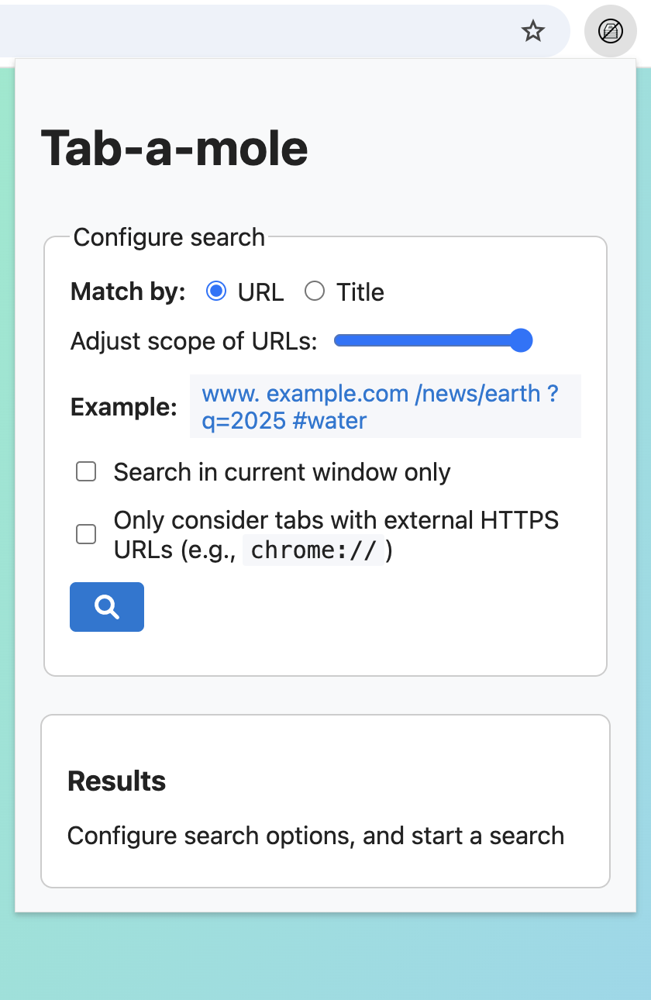
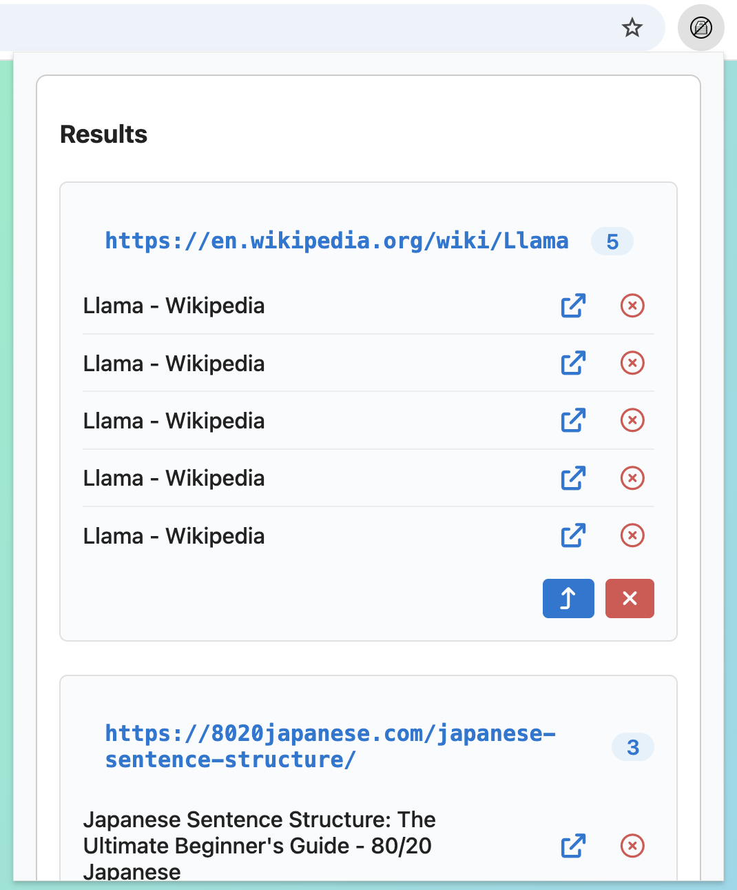

# Tab-a-mole

[](https://github.com/jzer7/tab-a-mole/actions/workflows/build.yml)

Tab-a-mole is a Chrome extension that helps you find and manage duplicate tabs.

## Features

- **Find duplicate tabs** by URL or title similarity
- **Flexible matching** with adjustable URL scope (full URL, domain only, hostname, no query/hash)
- **Window-scoped search** to limit results to current window or search across all windows
- **HTTPS filtering** to exclude internal browser pages
- **Quick actions** to navigate to tabs or close duplicates
- **Display options** including theme selection (light/dark/system) and font size preferences
- **Time tracking** shows when tabs were last accessed

## Installation

### Manual Installation (Development)

1. Download the latest release from [GitHub Releases](https://github.com/jzer7/tab-a-mole/releases)
2. Extract the ZIP file
3. Open Chrome and go to `chrome://extensions/`
4. Enable "Developer mode" in the top right
5. Click "Load unpacked" and select the extracted folder

## Usage

<!-- markdownlint-disable MD033 -->
<div style="margin:10px">
  
  
</div>
<!-- markdownlint-enable MD033 -->

1. Click the Tab-a-mole extension icon in your Chrome toolbar
2. Choose your matching method
3. Adjust the URL scope slider to control how strict the matching is
4. Configure additional options
5. Click the search button to find duplicates
6. Review results and take action:
   - Click a tab to navigate to it
   - Close individual duplicate tabs
   - Close all duplicates in a group (keeps one tab open)

Access extension options by right-clicking the extension icon and selecting "Options" to customize display preferences.

## Development

This project is coded in TypeScript and uses Bun to manage the environment.

To install the extension for development in Chrome:

1. Clone or download this repository.
2. Build the extension with `make all`.
3. Open Chrome and navigate to the extensions page by entering
   `chrome://extensions` in the address bar.
4. Enable "Developer mode".
5. Click the "Load unpacked" button that appears on the top-left.
6. In the file selection dialog, navigate to the directory with these files.
7. The "Tab-a-mole" extension is loaded. Access the icon by clicking on the extension button.

### To debug

1. Start the development server:

   ```sh
   bun dev
   ```

2. This will launch a sandbox Chrome instance.

3. Load the extension once. Any changes to the code will be reflected on the extension.

## Known Limitations

- Title matching uses [Jaccard similarity](https://en.wikipedia.org/wiki/Jaccard_index) with a default threshold of 0.5, which may not catch all semantically similar titles

## Contributing

Feel free to open issues or submit pull requests for improvements or bug fixes.

## License

This project is licensed under the MIT License. See the [LICENSE](LICENSE) file for details.

:golf:
